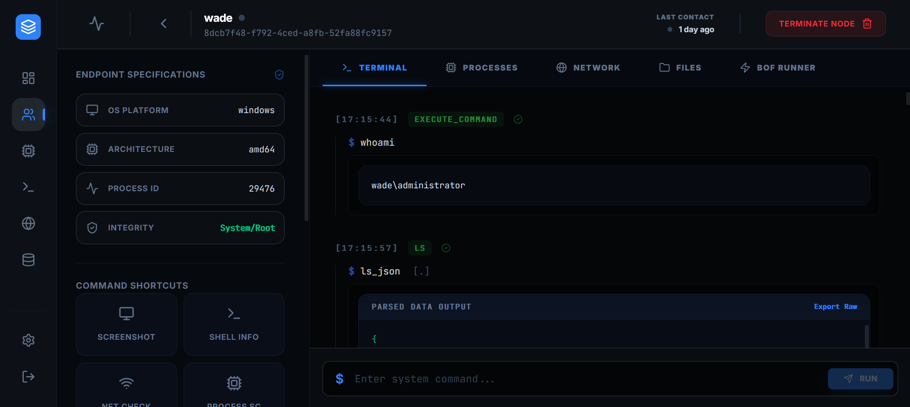
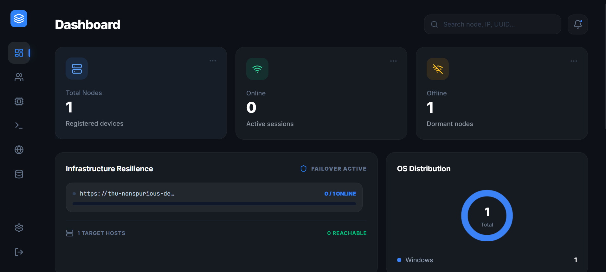

# ByteCode C2
### Strategic Command & Control Infrastructure for Advanced Security Operations


[](#)
[](#)
[](#)
[](#)
[](LICENSE)
[](https://goreportcard.com/report/github.com/wadecalvin9/bytecode)
[](https://github.com/wadecalvin9/bytecode/releases)
[](https://github.com/wadecalvin9/bytecode/stargazers)

ByteCode is a high-performance C2 framework engineered for advanced red-teaming, post-exploitation, and infrastructure resilience. It provides operators with a sophisticated suite of tactical primitives designed for stealthy operation in highly-monitored environments.

---

## Technical Specifications

###  Tactical Evasion & Stealth
*   **Dynamic Syscall Invocation**: Implements Hell's Gate/Halo's Gate techniques to bypass EDR/AV hooks by dynamically extracting SSNs and executing syscalls via assembly stubs.
*   **Cryptographic Transport Layer**: All C2 traffic is secured using AES-256-GCM with a build-time injected Pre-Shared Key (PSK).
*   **Memory Obfuscation**: Agent configuration and state are masked using XOR-based encryption during sleep cycles to minimize memory forensics signatures.
*   **Ghost Injection**: Supports stealthy process injection using indirect syscalls for memory allocation and thread creation.

###  Operational Primitives
*   **In-Memory Artifact Execution**: Reflective COFF loader for executing Beacon Object Files (BOFs) directly in memory without disk artifacts.
*   **Privilege & Identity Management**: Native support for token impersonation, privilege auditing, and credential vault discovery.
*   **Artifact Factory**: Integrated build pipeline for generating hardened, customized agent binaries with build-time configuration injection.
*   **Data Explorer**: Centralized repository for exfiltrated assets, featuring integrity-validated download protocols.

###  Infrastructure Resilience
*   **C2 Pool Failover**: Supports multi-host infrastructure pools with automatic agent failover and rotation.
*   **Real-time Telemetry**: WebSocket-driven dashboard providing sub-second latency for command execution and infrastructure status monitoring.
*   **Persistent Intelligence**: SQLite-backed logging ensuring operational history and agent states are preserved across server reboots.

---

## Getting Started

### Prerequisites

Ensure your development environment meets the following specifications:

*   **Node.js**: `v20.x` or higher
*   **Go**: `v1.22.x` or higher (Required for Artifact Factory)
*   **Redis**: `v6.x` or higher
    *   *Docker (Recommended)*: `docker-compose up -d redis`
    *   *Manual*: `sudo apt install redis-server -y`
*   **Git**: For version control

### 1. Installation

#### Global Installation (Recommended for Operators)
You can install the ByteCode CLI globally to access the command from anywhere:

```bash
# Install the tactical CLI globally
npm install -g bytecode-c2

# Launch the system
bytecode-c2 start
```



#### NPX (One-time Run)
Execute the system without global installation:

```bash
npx bytecode-c2 start
```

#### Local Development Setup
If you are modifying the source code, use the local setup:

```bash
# Install all dependencies recursively
npm run install-all

# Compile the dashboard
npm run build

# Run via local script
npm start
```

### 2. Command Reference

The `bytecode` CLI provides several commands for infrastructure management:

| Command | Description |
| :--- | :--- |
| `bytecode-c2 start` | Launches the C2 server and operator dashboard |
| `bytecode-c2 --version` | Displays the current system version |
| `bytecode-c2 --help` | Shows available command primitives |

---

### 3. Dashboard Build

The React-based operator dashboard must be compiled before the server can serve it:

```bash
# Compile the Vite/React dashboard
npm run build
```



---

## Deployment via Docker (Recommended)

For production environments, Docker provides a containerized, self-contained deployment of the server, dashboard, and Redis dependency.

### 1. Fast Deployment
```bash
# Build and launch the full stack
docker-compose up -d
```

### 2. Service Management
*   **Logs**: `docker-compose logs -f`
*   **Stop**: `docker-compose down`

---

## Operational Workflow

### 1. Infrastructure Verification
Verify that the Redis service is active and the database is initialized. The system will automatically perform a health check on startup.

### 2. Artifact Generation
Generate a tactical agent via the **Artifact Factory** in the dashboard.
*   **Agent Identity**: Customize binary naming (e.g., `svchost.exe`) for environmental blending.
*   **C2 Pool**: Configure primary and failover infrastructure nodes.
*   **Jitter/Interval**: Define beaconing patterns to bypass heuristic analysis.

### 3. Tactical Deployment
Deploy the generated binary on the target environment. The agent will automatically initialize the beaconing protocol and appear in the **Infrastructure Monitor**.

---

##  Security & Access Control

### Operational Integrity
*   **Default Credentials**: The initial system deployment utilizes `admin` / `bytecode`. 
*   **Credential Rotation**: Operators must rotate passwords via the **Settings** panel immediately upon deployment.
*   **Persistence**: Operational data is stored in `./data/bytecode.db`. This database preserves all historical exfiltration and tasking; it is **never** overwritten during system restarts.

---

## Developmental Roadmap

- [x] **Milestone 1**: AES-GCM Transport, Multi-host Failover, Redis Integration.
- [x] **Milestone 2**: Hell's Gate Syscall Implementation, Memory Masking.
- [x] **Milestone 3**: Reflective BOF Loader, Artifact Factory, Terminal Clear Primitives.
- [ ] **Milestone 4**: SOCKS5 Tunneling, UDRL Integration, Kernel-Mode Persistence.

---
## Legal Disclaimer
*This framework is designed for authorized professional security auditing and educational purposes only. Unauthorized use on systems without explicit prior consent is strictly prohibited and may be illegal.*
